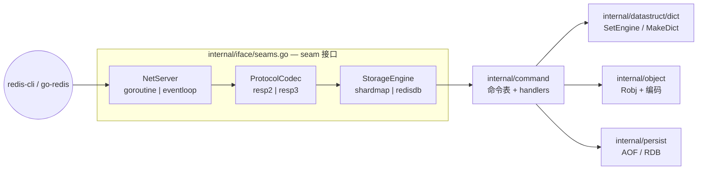
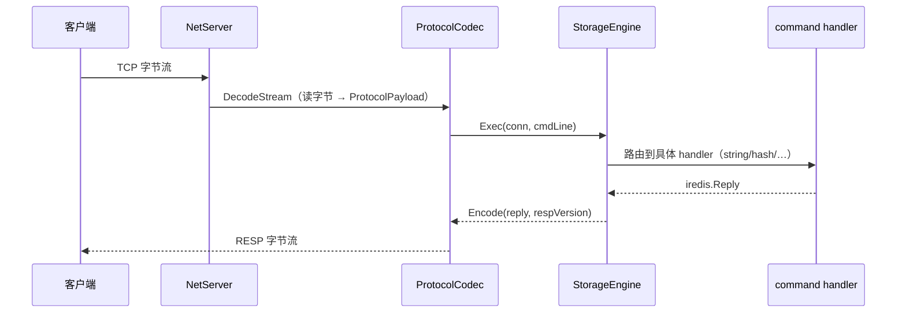

# hayakv 架构详解

> 受众：即将修改 hayakv 代码的开发者。阅读本文后你应该能回答：「我要改的那行代码在哪一层？修改会影响哪些后端组合？」

---

## 1. 为什么是 strangler-fig 架构

hayakv fork 自 [HDT3213/godis](https://github.com/HDT3213/godis)，目标是逐层向 Redis 8.x 对齐，以**字节级回复一致性**作为验收标准（由差分测试哈ness 强制执行）。

直接重写整个 godis 风险高、周期长。strangler-fig 模式提供了一条务实的路径：

1. **保留 godis 基线**——已经可用，测试覆盖良好。
2. **在每一层切一个 seam**（Go interface）——基线实现与 Redis-faithful 重写都实现同一接口。
3. **运行时通过配置切换**——同一套差分测试语料可以对 A/B 两个后端同时运行，回归无处遁形。
4. **逐层"绞杀"**——当某层的 Redis-faithful 重写通过差分测试，即可默认启用，无需触动其他层。

目前暴露三个可切换的 seam，对应三个配置键：

| 配置键 | 可选值 | 控制的 seam |
|---|---|---|
| `net` | `goroutine` \| `eventloop` | `NetServer` — goroutine-per-conn vs 单线程 kqueue/epoll 事件循环 |
| `engine` | `shardmap` \| `redisdb` | `StorageEngine` — 分片 map vs 单 dict + 增量 rehash |
| `proto-max` | `resp2` \| `resp3` | `ProtocolCodec` — RESP3 通过 `HELLO` 命令协商 |

---

## 2. 三个 seam 的接口定义

所有 seam 接口集中定义在 `internal/iface/seams.go`，是阅读整个项目的起点。

### NetServer（L25）

```go
// internal/iface/seams.go:25
type NetServer interface {
    Run(ctx context.Context, addr string, handler NetHandler) error
    Close() error
}
```

`NetServer` 只负责监听 TCP 并把连接交给 `NetHandler`。两个实现：
- `internal/net/goroutine` — 每条连接一个 goroutine（godis 基线）。
- `internal/net/eventloop` — 单线程 kqueue/epoll 循环（Redis-faithful，无锁）。

### NetHandler（L31）

```go
// internal/iface/seams.go:31
type NetHandler interface {
    Handle(ctx context.Context, conn net.Conn)
    Close() error
}
```

`NetHandler` 处理单条连接的读写与命令分发。goroutine 后端的 handler 由 `internal/net/goroutine.NewHandlerWithDB` 创建，内嵌 `ProtocolCodec` 与 `StorageEngine`。

### ProtocolCodec（L43）

```go
// internal/iface/seams.go:43
type ProtocolCodec interface {
    DecodeStream(reader io.Reader) <-chan ProtocolPayload
    DecodeOne(data []byte) (iredis.Reply, error)
    Encode(reply iredis.Reply, resp RespVersion) []byte
}
```

负责 RESP 字节流 ↔ `iredis.Reply` 的编解码。两个实现：`internal/proto/resp2.Codec` 和 `internal/proto/resp3.Codec`。

### StorageEngine（L63）

```go
// internal/iface/seams.go:63
type StorageEngine interface {
    Exec(client iredis.Connection, cmdLine CmdLine) iredis.Reply
    AfterClientClose(client iredis.Connection)
    Close()
}
```

"执行一条命令"的抽象——seam 切在命令执行高度（详见第 4 节）。

### Object（L70）

```go
// internal/iface/seams.go:70
type Object interface {
    TypeName() string
    EncodingName() string
    Value() any
}
```

用于 `OBJECT ENCODING` / `TYPE` 等命令对存储值进行类型与编码自省，由 `internal/object` 的 `Robj` 实现。

### ScriptEngine（L83）

```go
// internal/iface/seams.go:83
type ScriptEngine interface {
    Eval(...)
    EvalSha(...)
    ...
}
```

服务端脚本层（默认实现：gopher-lua）。可以替换为 cgo/liblua 实现而无需触动命令层。

---

## 3. 工厂接线：`internal/server/backends.go`

`backends.go` 是把配置映射到具体实现的唯一工厂，`cmd/hayakv/main.go` 只做装配，不做策略决策。

### 三个工厂函数

| 工厂函数 | 行号 | 作用 |
|---|---|---|
| `NewStorageEngine` | `backends.go:56` | 按 `engine` 配置创建 `StorageEngine`，并在 `redisdb`+`goroutine` 组合时自动包裹 `LockedEngine` |
| `NewProtocolCodec` | `backends.go:91` | 按 `proto-max` 配置返回 `resp2.Codec` 或 `resp3.Codec` |
| `NewNetServerWithEngine` | `backends.go:109` | 按 `net` 配置创建 `NetServer`；eventloop 后端直接在构造时注入 engine |

### `cmd/hayakv/main.go` 的装配顺序

```
NewStorageEngine(cfg)            // 创建 engine（含锁包裹）
MaybeWrapCluster(cfg, engine)    // 可选：Redis Cluster 装饰器
NewNetServerWithEngine(cfg, engine)  // 创建 NetServer
NewProtocolCodec(cfg)            // 创建 codec
// eventloop 后端：通过 SetCodec 接口注入 codec（main.go:108）
goroutinenet.NewHandlerWithDB(engine, codec)  // 创建 goroutine handler
netServer.Run(ctx, addr, handler)
```

eventloop 后端的 codec 注入发生在 `cmd/hayakv/main.go:108`：

```go
if elServer, ok := netServer.(interface{ SetCodec(iface.ProtocolCodec) }); ok {
    elServer.SetCodec(codec)
}
```

这里使用接口断言而非直接依赖，避免了 `main` 包对 eventloop 包的硬依赖。

---

## 4. StorageEngine seam 切在哪个高度

这是整个架构中最重要的设计决策，在 `seams.go` 的注释里有明确记录（L49–L62）：

> **StorageEngine seam 切在"执行一条命令"的高度（godis `DB.Exec`），而非更低的 Get/Set/Del 层。**

具体含义：

- `engine=shardmap`：`dict.SetEngine("shardmap")` → `MakeDict()` 返回 `ConcurrentDict`（分片 map）；命令层由 `internal/command` 的 `NewStandaloneServer()` 承载。
- `engine=redisdb`：`dict.SetEngine("redisdb")` → `MakeDict()` 返回 `RedisDict`（单 dict + 增量 rehash）；命令层**同样**由 `internal/command` 承载，不替换。

两种后端共享全部 `internal/command` 代码——命令 handler、路由表、事务、AOF 写入、复制协议——切换的只是底层 dict 的实现。

**为什么采用这个快捷方式？** godis 的命令层体量最大，贸然重写风险极高。strangler-fig 的精髓是「把真实 Redis 的行为一点一点注入，而不是一次性替换」。先通过 dict 工厂切换存储引擎，等命令层足够稳定后再考虑下沉 seam。

dict 工厂的核心逻辑在 `internal/datastruct/dict/factory.go`：

```go
func MakeDict() Dict {
    if eng == EngineRedisDB {
        return MakeRedis(size)   // RedisDict：单 dict + 增量 rehash
    }
    return MakeConcurrent(size)  // ConcurrentDict：分片 map
}
```

---

## 5. 锁模型矩阵

不同的后端组合需要不同的并发保护策略：

| | `net=goroutine`（多 goroutine 并发） | `net=eventloop`（单线程串行） |
|---|---|---|
| `engine=shardmap` | **分片锁**：`ConcurrentDict` 内部按 key hash 分 shard，每 shard 一把 `sync.RWMutex`，goroutine 之间几乎无竞争 | **分片锁**（同左，事件循环单线程执行，实际上锁不会被争抢） |
| `engine=redisdb` | **全局互斥锁**：`server.NewLockedEngine`（`internal/server/locked_engine.go:19`）将所有 `Exec`/`AfterClientClose`/`Close` 调用串行化；`RedisDict` 本身不加锁 | **无显式锁**：事件循环单线程串行执行，天然互斥；codec 通过 `SetCodec` 接口注入（`cmd/hayakv/main.go:108`） |

`NewLockedEngine` 实现非常简单——一把 `sync.Mutex` 包住所有三个接口方法（`internal/server/locked_engine.go`）：

```go
func (le *lockedEngine) Exec(client redis.Connection, cmdLine iface.CmdLine) redis.Reply {
    le.mu.Lock()
    defer le.mu.Unlock()
    return le.inner.Exec(client, cmdLine)
}
```

---

## 6. 数据流图

### 静态结构：各层与 seam 的关系



> 注意：`NetServer` 和 `ProtocolCodec` 在 goroutine 后端是通过 `NetHandler`（`goroutine.HandlerWithDB`）内嵌耦合的；在 eventloop 后端，codec 通过 `SetCodec` 在启动时注入到 `NetServer`。两者都满足上图的逻辑数据流。

### 动态流程：一次命令请求的生命周期



---

## 7. 目录速查

```
cmd/hayakv/        入口：加载 config、按顺序调用工厂、组装 seam、启动监听
config/            redis.conf 兼容解析器
internal/
  iface/           所有 seam 接口定义（先读这里）
  server/          backends.go 工厂 + locked_engine.go
  net/goroutine/   goroutine-per-conn NetServer + NetHandler
  net/eventloop/   单线程事件循环 NetServer
  proto/resp2/     RESP2 codec
  proto/resp3/     RESP3 codec
  command/         命令表 + 全部 handler（godis 命令层，两种 engine 共享）
  object/          Robj + Redis 原生编码（listpack、intset、embstr 等）
  datastruct/dict/ dict 工厂（factory.go）+ ConcurrentDict + RedisDict
  persist/         AOF（含 RDB via AOF rewrite）
test/diff/         差分测试 harness（对比 hayakv 与真实 Redis 8 的回复）
```

---

## 8. 如何定位你要改的代码

| 你想改的事情 | 从哪里入手 |
|---|---|
| 添加/修改一个 Redis 命令 | `internal/command/` 对应类型的文件（`string.go`、`hash.go` 等）；需同步更新差分语料 |
| 改变网络模型 | `internal/net/goroutine/` 或 `internal/net/eventloop/`；seam: `iface.NetServer` + `iface.NetHandler` |
| 改变 dict 底层实现 | `internal/datastruct/dict/`；通过 `factory.go` 的 `MakeDict` 透明切换 |
| 改变 RESP 编解码 | `internal/proto/resp2/` 或 `internal/proto/resp3/`；seam: `iface.ProtocolCodec` |
| 改变存储引擎组装逻辑 | `internal/server/backends.go`（工厂）；锁策略见 `locked_engine.go` |
| 理解某命令的 Redis 对齐状态 | 运行 `go test ./test/diff -run TestDifferential...`，查看该命令在差分语料中的覆盖情况 |

---

*本文对应代码版本见仓库 `main` 分支。如发现描述与代码不符，以代码为准。*
