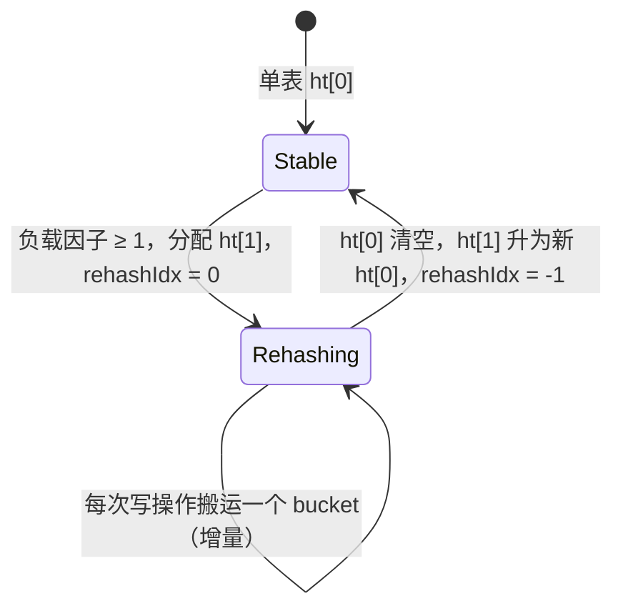

# 第 03 章：dict 与增量 rehash

> **前置章节**：[02 — Robj 与对象编码](02-object.md)
>
> **本章目标**：理解 Redis dict 的双表结构与增量 rehash 机制，并在 hayakv 代码里
> 逐行找到对应实现；掌握两套 dict 后端（`shardmap` / `redisdb`）的设计差异，以及
> 全局工厂如何让 dict 成为可切换的 seam。

---

## 一、本章导读

上一章讲的 `Robj` 是单个值的包装；本章往上走一层，看 Redis 如何**存储所有 key**。
Redis 进程里几乎每一张表——keyspace（所有 key 的主索引）、expires（过期时间）、hash 对象的底层存储——都由同一个数据结构 `dict` 承载。理解 dict，就理解了 Redis 最核心的存储层。

本章从「为什么要增量 rehash」讲起，然后带你逐函数读 hayakv 里的 `RedisDict` 实现，顺带过一遍 godis 遗产 `ConcurrentDict`，最后用 `factory.go` 把两者串到整体架构里。

---

## 二、Redis 原理

### 2.1 dict 是什么

Redis 的 `dict` 本质上是一张开链哈希表（separate chaining）。每个 bucket 是一条
entry 链表，entry 保存 `key`、`val`、`next` 指针。Redis 6 及以后，主数据库对象模型里
存在两张这样的表：

- **keyspace dict**：所有 key 到 value（`robj*`）的映射，就是你 `SET`/`GET` 操作的主表。
- **expires dict**：每个设置了过期时间的 key 到绝对时间戳的映射，结构相同、与 keyspace 平行存在。

Hash 类型对象在 key 数量较多时，底层存储同样是一张 dict（listpack 小对象晋升后的大 hash）。

### 2.2 为什么不能一次性 rehash

哈希表负载过高时必须扩容（即 rehash）——把所有 entry 搬到一张更大的新表里。最朴素的做法是一口气搬完，但 Redis 是**单线程命令执行模型**：一次搬迁百万级 key 会独占事件循环，造成几十到几百毫秒的尖刺延迟（stop-the-world pause），对低延迟服务不可接受。

Redis 的解法是**增量（渐进式）rehash**：把整张表的搬迁工作分摊到后续每一次写操作和定时任务里，每次只搬一个 bucket，让服务始终保持响应。

### 2.3 双表机制详解

Redis dict 内部同时维护两张哈希表，习惯上称 `ht[0]` 和 `ht[1]`。正常状态下只用 `ht[0]`，`ht[1]` 为空。

**触发条件（负载因子阈值）**

Redis 用"已使用 entry 数 / bucket 数"作为负载因子：

- **普通情况**：负载因子 ≥ 1 时触发扩容，分配一张大小为当前 bucket 数 × 2（向上取 2 的幂）的新表作为 `ht[1]`，`rehashidx` 置 0，rehash 开始。
- **有 BGSAVE / BGREWRITEAOF 进行时**：Redis 提高阈值到 5，避免在 fork 期间扩容导致 copy-on-write 内存暴涨。

> hayakv 当前实现（`redisdict.go`）仅应用负载因子 = 1 的简化阈值，不感知 BGSAVE，
> 与真实 Redis 在行为上的差异仅影响扩容时机，不影响正确性。

**rehash 期间的读写语义**

一旦进入 rehash：

- **写操作（Put/Remove）**：新 key 始终插入 `ht[1]`，不再进入 `ht[0]`，保证搬迁过程中 `ht[0]` 只减不增。同时顺手推进一步搬迁（`rehashStep`）。
- **读操作（Get）**：先查 `ht[0]`，找不到再查 `ht[1]`，确保数据在两表间不丢失。Remove 则同时尝试两张表。
- **定时任务**（真实 Redis 里的 `dictRehashMilliseconds`）：在空闲时批量推进，防止搬迁过慢。

**搬迁完成**：`ht[0]` 的所有 bucket 都被清空后，`ht[1]` 升级为新的 `ht[0]`，`ht[1]` 置空，`rehashidx` 回到 -1。

**状态机一览**：



### 2.4 与 Go 内建 map 的对比

Go 的内建 `map` 已经内置了渐进式扩容（evacuation），读者可能会问：hayakv 为什么
还要手写一套 Redis dict？

有三个动机：

1. **教学忠实性**：本项目的目标是重现 Redis 内核的工作方式，让读者理解真实的 dict 是
   怎么运转的，而不是依赖 Go runtime 的黑盒实现。
2. **SCAN 游标语义**：Redis `SCAN` 命令的游标有严格的"不重不漏"保证（只要数据没删除，
   cursor 循环一圈必然能覆盖所有 key）。真实 Redis 用**reverse binary iteration**（二进
   制位翻转游标）实现这一点。hayakv 的 `RedisDict.DictScan` 采用直接的线性 bucket 索引
   编码，能正确遍历 rehash 期间的双表，保证所有 key 都被返回（详见 §3.3）。
3. **行为对齐**：分片 map（Go map + 分段锁）的语义与 Redis 单线程 dict 不同，无法在
   不侵入命令层的情况下精确复现 Redis 的逐条操作顺序。`RedisDict` 提供了行为更接近
   Redis 的底座。

---

## 三、hayakv 实现带读

### 3.1 RedisDict：表结构与 hash 函数

源文件：`internal/datastruct/dict/redisdict.go`

```go
// redisdict.go:16
type entry struct {
    key  string
    val  interface{}
    next *entry
}

type hashTable struct {
    buckets []*entry
    mask    uint64
    used    int
}

// RedisDict 用 [2]*hashTable 同时持有 ht[0] 和 ht[1]
type RedisDict struct {
    tables    [2]*hashTable
    rehashIdx int // -1 表示未在 rehash
    count     int
    mu        sync.RWMutex
}
```

`tables[0]` 是主表，`tables[1]` 在 rehash 期间作为目标表，平时为 `nil`。`rehashIdx`
记录下一个待搬迁的 bucket 下标；`-1` 代表稳定状态。

hash 函数使用 **FNV-1a 64-bit**（`redisdict.go:72`）：

```go
func fnv1a(key string) uint64 {
    const (
        offset64 = 14695981039346656037
        prime64  = 1099511628211
    )
    hash := uint64(offset64)
    for i := 0; i < len(key); i++ {
        hash ^= uint64(key[i])
        hash *= prime64
    }
    return hash
}
```

真实 Redis 使用 SipHash（Redis 4+ 默认，用于防 HashDoS），hayakv 在这里保留了 FNV-1a
以降低实现复杂度——差分测试层仍能捕捉 hash 分布差异导致的任何行为偏差。

`nextPower`（`redisdict.go:57`）确保 bucket 数始终是 2 的幂，从而可以用 `hash & mask`
替代取模运算。

### 3.2 触发 expand 与 rehash 步进

**何时触发**（`redisdict.go:91`）：

```go
func (d *RedisDict) startRehashIfNeeded() {
    if d.isRehashing() {
        return
    }
    ht := d.tables[0]
    if ht.used == 0 {
        return
    }
    if float64(ht.used)/float64(len(ht.buckets)) >= loadFactor {
        d.startRehash(len(ht.buckets) * 2)
    }
}
```

`loadFactor = 1`（`redisdict.go:12`），即 entry 数量达到 bucket 数量时触发，扩容到
原来的 2 倍。每次调用 `Put`/`PutIfAbsent`/`PutIfExists` 时都会先调此函数。

**步进函数**（`redisdict.go:123`）：

```go
func (d *RedisDict) rehashStep() {
    // 找下一个非空 bucket
    for d.rehashIdx < len(ht0.buckets) {
        e := ht0.buckets[d.rehashIdx]
        if e == nil {
            d.rehashIdx++
            continue
        }
        // 把整条链迁移到 ht[1]
        ht0.buckets[d.rehashIdx] = nil
        for e != nil {
            next := e.next
            idx := fnv1a(e.key) & ht1.mask
            e.next = ht1.buckets[idx]
            ht1.buckets[idx] = e
            ht1.used++
            e = next
        }
        d.rehashIdx++
        return  // 每次只搬一个 bucket
    }
    // 搬完：ht[1] 升为 ht[0]
    d.tables[0] = d.tables[1]
    d.tables[1] = nil
    d.rehashIdx = -1
}
```

每次调用只搬迁**一个 bucket**，搬完立即返回，将控制权交还给调用者。空 bucket（`nil`）
直接跳过计数器递增，避免在稀疏表上空转。

**读写路径如何感知 rehash**（`redisdict.go:158`，`bucketIndex`）：

```go
func (d *RedisDict) bucketIndex(key string) (ht *hashTable, idx uint64) {
    h := fnv1a(key)
    if d.isRehashing() {
        ht0 := d.tables[0]
        if int(h&ht0.mask) >= d.rehashIdx {
            return ht0, h & ht0.mask   // 还没搬过来，在 ht[0]
        }
        return d.tables[1], h & d.tables[1].mask  // 已搬，在 ht[1]
    }
    ht = d.tables[0]
    return ht, h & ht.mask
}
```

通过比较 bucket 下标与 `rehashIdx`，单次调用即可确定 key 应在哪张表，无需双表顺序查找。
`Remove` 是例外——它对两张表都尝试（`redisdict.go:280`），因为 rehash 期间旧 key
仍可能残留在 `ht[0]`。

### 3.3 SCAN 游标与 rehash 共存

`DictScan`（`redisdict.go:456`）采用**线性 bucket 索引**编码游标：

- 稳定状态（单表）：`cursor` 直接是 `ht[0]` 的 bucket 下标，从 0 扫到 `ht0Size-1`，返回 0 表示扫描结束。
- **rehash 期间**：游标用偏移区间区分两张表：`[0, ht0Size)` 属于 `ht[0]`，`[ht0Size, ht0Size+ht1Size)` 属于 `ht[1]`。单次调用从当前位置扫到攒够 `count` 个结果，返回下一个起始游标。只要调用方循环直到返回 0，所有 key 都会被覆盖。

> **与真实 Redis 的差异**：真实 Redis `SCAN` 使用 **reverse binary iteration**（`dict.c:
> dictScan`），即对游标做位翻转后在哈希空间里跳跃，保证在 rehash 发生时也不会漏 key、
> 不会重复 key（弱保证：允许少量重复）。hayakv 当前实现不做位翻转，在 rehash 期间
> `ht[0]` 已经搬走的部分会被跳过，由 `ht[1]` 的扫描补充，总体不漏 key，但游标语义与
> Redis 不完全一致。`redisdict.go` 里的 `bitReverse`/`reverseBits` 函数（`redisdict.go:
> 416`）已经实现了位翻转工具，是未来接入 reverse binary iteration 的准备。

### 3.4 ConcurrentDict：godis 分片 map

源文件：`internal/datastruct/dict/concurrent.go`

`ConcurrentDict`（`concurrent.go:14`）是 godis 遗产，`engine=shardmap` 的底层。它把
整个 key 空间拆成 N 个分片（`shard`），每个分片是一张 Go 内建 `map[string]interface{}`
加一把 `sync.RWMutex`：

```go
type ConcurrentDict struct {
    table      []*shard
    count      int32
    shardCount int
}

type shard struct {
    m     map[string]interface{}
    mutex sync.RWMutex
}
```

key 通过 FNV-32（`fnv32`，`concurrent.go:72`）散列到对应分片，操作时只锁该分片，
大幅降低全局锁竞争。分片数默认为 `1<<16`（65536），由 `factory.go` 的 `dictSize` 配置。

这一设计适合多 goroutine 并发写的场景（`engine=shardmap` + `net=goroutine`），但
与 Redis 单线程模型的语义有差距：同一时刻可以有多个分片持锁并发写入，SCAN 遍历顺序
与 Redis 不一致，事务语义也更复杂（`RWLocks`/`RWUnLocks` 需要全局排好序批量加锁
以避免死锁，见 `concurrent.go:407`）。

### 3.5 factory.go：全局工厂与 seam

源文件：`internal/datastruct/dict/factory.go`

```go
var (
    engine   = EngineShardMap   // 默认 "shardmap"
    engineMu sync.RWMutex
    dictSize = 1 << 16
)

func SetEngine(name string) { ... }
func MakeDict() Dict {
    if eng == EngineRedisDB {
        return MakeRedis(size)
    }
    return MakeConcurrent(size)
}
```

`SetEngine` 和 `MakeDict` 是全局工厂，`engine=redisdb` 的切换就是在服务启动时调
`SetEngine("redisdb")`，此后所有 `MakeDict()` 调用都返回 `RedisDict`。

这里的设计有些特别：架构文档里的 `StorageEngine` seam（`internal/iface/seams.go:63`）
被切在「执行一条命令」的高度，而**不是** Get/Set/Del 单操作级别。dict 工厂是一个
**更底层的旋钮**，它通过全局变量影响 godis 命令层内部的存储实现，而不通过接口注入。
这是 strangler-fig 架构的一个有意识的折中——命令路由、事务、AOF 等逻辑不需要改动，
只需换掉底层的哈希表。详见 [docs/dev/architecture.md](../dev/architecture.md)。

### 3.6 dict_property_test.go：性质测试

源文件：`internal/datastruct/dict/dict_property_test.go`

性质测试（property-based testing）使用 `pgregory.net/rapid` 框架，对 `RedisDict`
进行随机生成输入的大批量验证。有别于传统用例手写期望值，性质测试描述**不变量**：

- `TestRedisDictPropertyPutGet`：任意序列的 Put 之后，Get 总返回最后写入的值。
- `TestRedisDictPropertyLen`：最终 `Len()` 等于写入的不重复 key 数量。
- `TestRedisDictPropertyRemove`：Remove 后 key 不可见、`Len()` 准确归零。
- `TestRedisDictPropertyPutIfAbsent`：`PutIfAbsent` 的幂等性——第二次调用不覆盖已有值。

这套测试对拍的是 `RedisDict` 自身的内部一致性（不是与真实 Redis 比对），与差分测试互
补：差分测试看行外语义（协议层面），性质测试看内部不变量（实现层面）。

---

## 四、动手验证

### 4.1 运行 dict 单元测试与性质测试

```bash
# 所有 dict 测试（含 race detector），预计 1–2 秒通过
go test -race ./internal/datastruct/dict/ -count=1
```

实际输出（本机）：

```
ok  	github.com/amemiya02/hayakv/internal/datastruct/dict	1.444s
```

```bash
# 单独运行 rehash 专项测试（-v 可观察到 PASS）
go test -race ./internal/datastruct/dict/ -run TestRedisDict_Rehash -count=1 -v
```

实际输出：

```
=== RUN   TestRedisDict_Rehash
--- PASS: TestRedisDict_Rehash (0.00s)
PASS
ok  	github.com/amemiya02/hayakv/internal/datastruct/dict	1.149s
```

`TestRedisDict_Rehash` 往一个初始 bucket 数为 4 的 `RedisDict` 里写入 100 个 key，
完整触发多轮 rehash，然后逐一验证所有 key 可读取。

### 4.2 切换 engine=redisdb 观察行为一致性

```bash
# 1. 编译
go build ./cmd/hayakv

# 2. 复制一份配置，把 engine 改为 redisdb
cp redis.conf /tmp/hayakv-redisdb.conf
sed -i '' 's/engine shardmap/engine redisdb/' /tmp/hayakv-redisdb.conf

# 3. 后台启动服务（监听 :6399）
CONFIG=/tmp/hayakv-redisdb.conf ./hayakv &

# 4. 测试 SET / GET / SCAN
redis-cli -p 6399 PING
redis-cli -p 6399 SET foo bar
redis-cli -p 6399 GET foo
redis-cli -p 6399 SET hello world
redis-cli -p 6399 SCAN 0 COUNT 100

# 5. 清理
kill %1
rm -f hayakv /tmp/hayakv-redisdb.conf
```

实际输出（本机）：

```
PONG
OK
bar
OK
0
b45
b44
s
n
l
foo
hello
```

`SCAN 0 COUNT 100` 返回游标 `0`（扫描完毕）以及所有已写入的 key，行为与
`engine=shardmap` 完全一致。

---

## 五、延伸阅读

- **Redis 源码**：[`src/dict.c`](https://github.com/redis/redis/blob/unstable/src/dict.c)
  — `dictRehash`、`dictRehashMilliseconds`、`dictScan`（reverse binary iteration 实现）
  是理解本章原理的一手资料。
- **SCAN 游标保证**：[redis.io/docs/latest/commands/scan/](https://redis.io/docs/latest/commands/scan/)
  — 官方文档详细说明了游标保证（full iteration guarantee）与 reverse binary iteration
  的设计动机。
- **项目架构**：[docs/dev/architecture.md](../dev/architecture.md) — strangler-fig seam
  分层、dict 工厂在整体架构中的位置、`engine` 配置键的完整说明。
- **下一章预告**：[04 — list/hash/set/zset 的实现与编码切换](04-datatypes.md)（规划中）
  — dict 是 hash 对象的大 key 底层存储；下一章会看到 listpack 如何晋升为 dict，以及
  list/set/zset 的编码切换逻辑。
