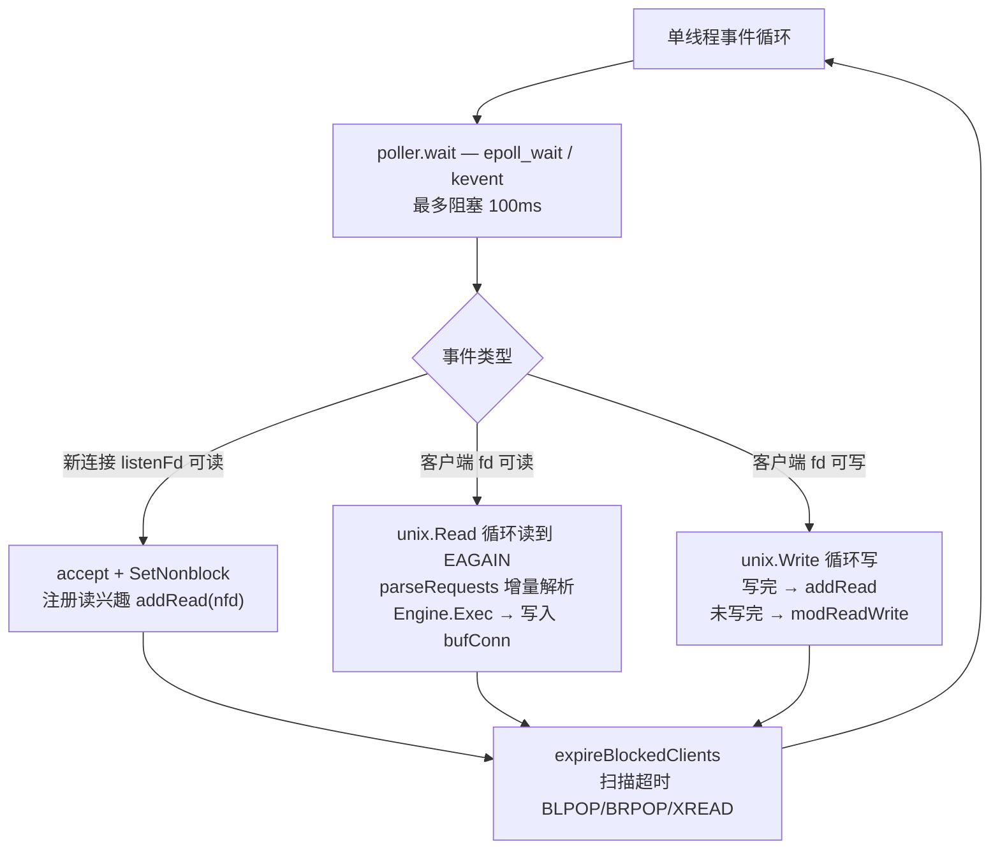

# 第 05 章：网络模型——goroutine vs 单线程事件循环

> **前置章节**：已读过第 01 章（RESP 协议）即可。建议同时打开
> [`../dev/architecture.md`](../dev/architecture.md) 的第 5 节（锁模型矩阵），
> 本章会多次与它互相引用。

---

## ① 本章导读

Redis 以"单线程"著称，而 Go 的惯用法是"每个连接一个 goroutine"。两者都能跑出
很高的吞吐量，但设计哲学截然不同，取舍也各异。

hayakv 通过 `NetServer` seam 同时实现了这两种模型，由 `net` 配置键在运行时切换：

| `net=` | 实现 | 包路径 |
|---|---|---|
| `goroutine`（默认） | goroutine-per-connection，godis 基线 | `internal/net/goroutine/` |
| `eventloop` | 单线程 kqueue/epoll 循环，Redis-faithful | `internal/net/eventloop/` |

读完本章，你能回答：

1. Redis 的单线程事件循环为什么快？它的代价是什么？
2. Go 的 goroutine 模型和事件循环在"本质"上有什么异同？
3. hayakv 的事件循环是怎么一行行跑起来的？

---

## ② Redis 原理

### 2.1 单线程为什么快

Redis 的核心命令处理路径（从读到执行到回复写入）运行在**单个线程**里。初学者常
有疑问：单线程怎么可能比多线程快？原因有三：

**所有操作都是内存操作。** `SET k v` 不访问磁盘，不做系统调用，只写一个哈希表
桶。一条典型命令的 CPU 开销在几百纳秒量级，比上下文切换（约 1–5 µs）还短。

**消灭了锁竞争和上下文切换。** 多线程模型中，保护共享数据结构必须加锁；高并发下
锁竞争会让线程频繁进入内核等待、切换线程栈，这笔开销往往比命令本身更贵。单线程
天然互斥——任意时刻只有一条命令在执行，根本不需要锁。

**瓶颈通常在网络 I/O，不在 CPU。** 客户端的请求在网线上需要几十微秒甚至更长；
CPU 处理命令只需几百纳秒。在这个比例下，提升 CPU 利用率对吞吐量的边际贡献极小，
而减少线程切换、缓存抖动带来的收益却可以被充分体现出来。

**这个模型的代价同样清晰。** 单线程意味着一条慢命令会阻塞所有其他客户端——这就
是 Redis 忌讳 O(N) 大命令（如 `KEYS *`、`SMEMBERS` 超大 set、`SORT` 无 LIMIT）
的根本原因：它们会在事件循环里独占若干毫秒甚至更长，让几千个并发连接全部卡住。
Redis 6.0 引入了 **I/O threads**：多线程负责网络读写，但命令执行仍在单线程——这
是在不破坏无锁语义的前提下提升 I/O 吞吐的折中方案。

### 2.2 epoll/kqueue 就绪通知模型

单线程要同时监视成千上万个连接，不可能每个连接都用一个阻塞 `read`——那样就需要
成千上万个线程。解决方案是 **I/O 多路复用**：

- 把所有感兴趣的 fd 注册到内核。
- 调用 `epoll_wait`（Linux）或 `kevent`（BSD/macOS）**阻塞等待**，内核在任意 fd
  就绪时将其放入就绪列表并返回。
- 单线程依次处理就绪事件，再次调用等待——循环往复。

这是**水平触发（Level Triggered）** 语义：只要 fd 的内核缓冲区里仍有数据，下次
`epoll_wait` 就会继续报告它可读。hayakv eventloop 使用的正是水平触发，因为它更
简单——即使一次没读完，下次循环还会提醒。

注册-等待-处理的循环结构在 Redis 源码里叫 `aeMain`，在 hayakv 里叫
`Server.Run`，思路完全一致。

### 2.3 Go 的 goroutine 模型

Go 的 `net.Conn.Read` 看起来是阻塞调用，但底层运行时其实也维护着一个 epoll/
kqueue 实例（**netpoller**）。当 `Read` 阻塞时，运行时把这个 goroutine 挂起，把
底层 fd 注册进 netpoller，等就绪后再把 goroutine 唤醒调度回来执行。

所以 **goroutine-per-connection 并非"1 连接 = 1 OS 线程"**，底层 I/O 复用机制
是相同的。两种模型的真正区别在于：

| 维度 | goroutine-per-conn | 单线程事件循环 |
|---|---|---|
| 并发单元 | 每连接一个 goroutine（~2 KB 初始栈，可增长） | 所有连接共用一个循环体 |
| 上下文切换 | Go 运行时在 GOMAXPROCS 个线程间调度 goroutine | 零切换，所有逻辑在一个 goroutine 里 |
| 代码结构 | 线性（`for payload := range ch { ... }`），易读 | 回调/状态机，读完 N 字节后可能要等下次循环 |
| 背压 | 天然：慢消费者的 goroutine 自然积压在调度队列 | 需手动管理写缓冲与写就绪事件 |
| 共享数据保护 | 需要锁（或 channel） | 单线程天然互斥，无需锁 |
| 慢命令代价 | 只阻塞当前连接的 goroutine | 阻塞全部连接 |

两种方式都有其价值。goroutine 模型更符合 Go 的惯用法，代码更线性，阅读和调试更
轻松，适合学习和快速迭代。事件循环模型与 Redis 行为更接近，无锁特性在高并发下
有真实的性能优势，也是 hayakv 用于差分测试验证的"Redis-faithful"路径。

### 2.4 单线程如何替代锁

`engine=redisdb` + `net=eventloop` 这个组合下，`RedisDict`（单个非分片字典）的
并发安全完全由事件循环的单线程串行性保证——任意时刻只有一个 `Exec` 调用在运行，
不存在并发写，因此不需要任何锁。

而换成 `engine=redisdb` + `net=goroutine`，多个客户端 goroutine 会并发调用
`Exec`，hayakv 在工厂里自动用 `server.NewLockedEngine` 包裹一把全局
`sync.Mutex`（见 [`../dev/architecture.md` §5 锁模型矩阵](../dev/architecture.md#5-锁模型矩阵)）。

---

## ③ hayakv 带读

### 3.1 goroutine 后端：`internal/net/goroutine/server.go`

```go
// internal/net/goroutine/tcp/server.go — accept 循环
for {
    conn, err := listener.Accept()   // 阻塞等待新连接
    ...
    go func() {
        defer ...
        handler.Handle(ctx, conn)    // 每个连接独享一个 goroutine
    }()
}
```

`handler.Handle` 就是 `internal/net/goroutine/server.go` 里的 `Handler.Handle`：

```go
// internal/net/goroutine/server.go:122
func (h *Handler) Handle(ctx context.Context, conn net.Conn) {
    client := connection.NewConn(conn)
    ...
    ch := h.codec.DecodeStream(conn)      // codec 在本 goroutine 内阻塞读流
    for payload := range ch {             // 顺序处理，线性清晰
        ...
        result := h.db.Exec(client, r.Args)
        _, _ = client.Write(h.codec.Encode(result, client.Protocol()))
    }
}
```

整个 Decode → Exec → Encode 都在**同一个 goroutine** 里内联完成，代码逻辑一眼直
观。goroutine 的栈会随请求大小自动增长，背压也是天然的：慢消费者的 goroutine 自
然堆积在调度器里，不会主动 OOM。

### 3.2 eventloop 后端：文件构成

```
internal/net/eventloop/
├── server.go        # 事件循环主体、accept/onReadable/flush/expireBlockedClients
├── poller.go        # poller 接口（平台无关抽象）
├── poller_darwin.go # kqueue 实现（build tag: //go:build darwin）
├── poller_linux.go  # epoll 实现（build tag: //go:build linux）
├── bufconn.go       # 内存写缓冲（写回时不直接 write fd，先缓存在此）
├── client.go        # 每个连接的状态（fd、读缓冲、写缓冲、阻塞命令）
├── reqparser.go     # 零分配 RESP2 增量解析器
└── block.go         # 阻塞命令注册表（BLPOP/BRPOP/XREAD）
```

**平台抽象**通过 Go build tags 实现：`poller_darwin.go` 以 `//go:build darwin`
编译 kqueue 实现，`poller_linux.go` 以 `//go:build linux` 编译 epoll 实现，两者
都实现同一个 `poller` 接口（`poller.go:9`），事件循环主体完全不感知平台差异。

### 3.3 单线程事件循环主体

```go
// internal/net/eventloop/server.go:80
events := make([]event, maxEvents)   // 最多 128 个就绪事件/轮
for {
    select {
    case <-ctx.Done():
        s.shutdown(); return nil
    default:
    }

    n, err := s.poller.wait(events, pollTimeout)  // (1) 等待就绪，最多阻塞 100ms
    ...
    for i := 0; i < n; i++ {
        ev := events[i]
        if ev.fd == s.listenFd {
            s.accept()           // (2) 新连接：accept + 注册读兴趣
            continue
        }
        c := s.clients[ev.fd]
        if ev.readable && c.blockKeys == nil {
            s.onReadable(c)      // (3) 可读：读缓冲 → 解析 → Exec → 写回缓冲
        }
        if ev.writable && c.bc.hasOut() {
            s.flush(c)           // (4) 可写：冲刷未写完的回复
        }
    }

    s.expireBlockedClients()     // (5) 超时检查（类 serverCron 机制）
}
```

**关键路径：`onReadable`（`server.go:186`）**

```go
func (s *Server) onReadable(c *client) {
    // 非阻塞 Read，循环读到 EAGAIN
    for {
        n, err := unix.Read(c.fd, buf)
        if err == unix.EAGAIN { break }
        c.queryBuf = append(c.queryBuf, buf[:n]...)
    }

    // 增量解析：一次读可能包含多个完整命令（流水线）
    cmds, consumed, err := parseRequests(c.queryBuf)
    c.queryBuf = c.queryBuf[consumed:]    // 只保留未完成的尾部

    for _, cmdLine := range cmds {
        reply := s.engine.Exec(c.conn, cmdLine)
        c.bc.Write(s.codec.Encode(reply, c.conn.Protocol()))
    }

    if c.bc.hasOut() { s.flush(c) }
}
```

**`flush` 与写就绪事件（`server.go:284`）**

```go
func (s *Server) flush(c *client) {
    written := 0
    for written < len(out) {
        n, err := unix.Write(c.fd, out[written:])
        if err == unix.EAGAIN { break }
        written += n
    }
    if written < len(out) {
        // 内核发送缓冲区满——先放回，注册写兴趣，等下次循环
        c.bc.out = append(out[written:], c.bc.out...)
        s.poller.modReadWrite(c.fd)   // 同时监听读+写
        c.wantWrite = true
    } else if c.wantWrite {
        // 全部写完，切回只监听读
        s.poller.addRead(c.fd)
        c.wantWrite = false
    }
}
```

写回路的逻辑体现了事件循环的典型风格：不能阻塞等待内核缓冲区腾空，必须把未写
完的数据缓存起来，注册写就绪兴趣，等内核回调。

**定时任务机制**

hayakv eventloop 没有独立的 `serverCron` goroutine，而是在每轮 `wait` 返回后调
用 `expireBlockedClients()`（`server.go:585`），扫描所有超时的阻塞连接（BLPOP/
BRPOP 等）并发送 null 回复。`pollTimeout = 100ms` 控制了这个"定时精度"——最坏
情况延迟 100ms 才检查超时，与 Redis 的 `hz=10`（100ms/次）量级相同。

**`SetCodec` 注入点（`server.go:46`）**

```go
func (s *Server) SetCodec(codec iface.ProtocolCodec) {
    s.codec = codec
}
```

eventloop 后端在构造时还不知道 codec，由 `cmd/hayakv/main.go` 在启动前通过接口
断言注入：

```go
// cmd/hayakv/main.go（参考 architecture.md §3）
if elServer, ok := netServer.(interface{ SetCodec(iface.ProtocolCodec) }); ok {
    elServer.SetCodec(codec)
}
```

这样 `main` 包不需要直接依赖 `eventloop` 包，只通过匿名接口解耦。

### 3.4 流程图



### 3.5 已移除的 gnet 后端

历史上 `internal/net/gnet/` 曾是 godis 遗留的、基于第三方库
[panjf2000/gnet](https://github.com/panjf2000/gnet) 的网络后端，由配置键
`use-gnet` 控制。但 `internal/server/backends.go` 的工厂函数从未引用它——`use-gnet`
是一个永远不会被读取的"死配置键"，整个包也无法通过标准启动路径激活。它因此被
整体删除：包、`use-gnet` 字段、以及 `go.mod` 中的 `panjf2000/gnet` 依赖均已移除。
hayakv 的两个网络后端就是本章讲的 goroutine 与 eventloop。

---

## ④ 动手验证

### 准备

```bash
# 确保已在仓库根目录
go build ./cmd/hayakv
```

### 用 eventloop 后端启动服务器

```bash
cp redis.conf /tmp/hayakv-el.conf
# 将 net goroutine 改为 net eventloop
sed -i '' 's/^net goroutine/net eventloop/' /tmp/hayakv-el.conf
grep '^net' /tmp/hayakv-el.conf    # 应输出: net eventloop

CONFIG=/tmp/hayakv-el.conf ./hayakv &
EL_PID=$!
```

### 验证行为与 goroutine 后端无差别

```bash
redis-cli -p 6399 ping
# PONG

redis-cli -p 6399 set k v && redis-cli -p 6399 get k
# OK
# v
```

### 运行 eventloop 单元测试

```bash
go test -race ./internal/net/eventloop/... -count=1
# ok  github.com/amemiya02/hayakv/internal/net/eventloop  1.733s
```

eventloop 包测试全部通过，无数据竞争。

### 清理

```bash
kill $EL_PID
rm -f /tmp/hayakv-el.conf hayakv
```

> **注意**：`go test -race ./internal/net/...` 会包含 `internal/net/goroutine/tcp/`，
> 该包存在来自 godis 的已知数据竞争，与 eventloop 无关。如需只验证 eventloop 包，
> 使用 `go test -race ./internal/net/eventloop/...`。

---

## ⑤ 延伸阅读

- **Redis 官方线程模型说明**：[redis.io — Redis is single threaded. How can I exploit
  multiple CPU / cores?](https://redis.io/docs/latest/operate/oss_and_stack/management/optimization/benchmarks/)
  以及 Redis 6.0 I/O threads 设计文档。
- **`man epoll_wait`**（Linux）/ **`man kevent`**（BSD/macOS）：了解水平触发与
  边缘触发的精确语义，以及 `EAGAIN`/`EWOULDBLOCK` 在非阻塞 I/O 中的含义。
- **[`../dev/architecture.md`](../dev/architecture.md)**：第 5 节"锁模型矩阵"完整
  描述了四种后端组合（`net` × `engine`）的并发保护策略，是本章"单线程替代锁"的
  配套参考。
- **第 06 章**：[采样式过期与 maxmemory 淘汰](06-expire-evict.md)——在单线程模型
  下，过期扫描和内存淘汰如何与命令执行共享同一个线程而互不阻塞。

---

*本文对应代码版本见仓库 `main` 分支。如发现描述与代码不符，以代码为准。*
