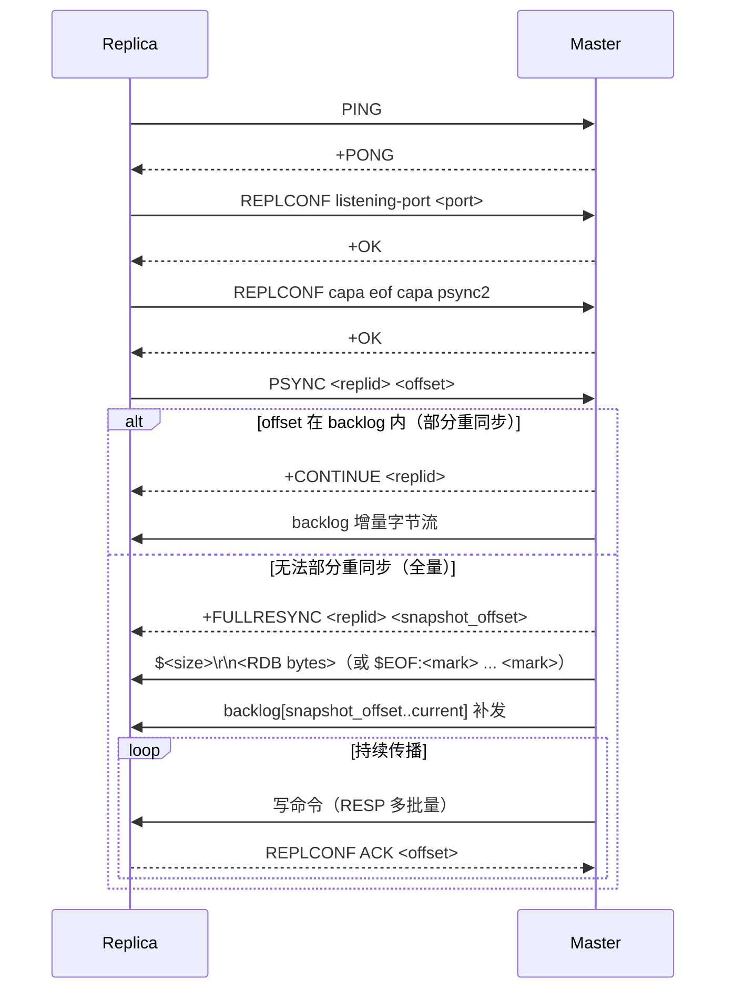

# 第 08 章：PSYNC 复制

> **前置章节**：第 07 章（RDB 与 AOF 持久化）——hayakv 的复制依赖 AOF `Listener`
> 接口实时捕获写命令，全量同步时也要把 RDB 发送给副本；理解持久化机制能让本章
> 的代码路径更清晰。

---

## 一、导读

「主从复制」是 Redis 高可用的基础。理解它的关键不是协议细节，而是一个抽象：
**用「复制 ID + 偏移量」来描述一段命令历史**。有了这个抽象，断线重连就不必重
传全量快照——只要 master 的环形缓冲区还保存了副本断线期间丢失的字节，一次
`+CONTINUE` 就能把增量部分补上，这叫**部分重同步（partial resync）**。

第 07 章结尾提到：AOF 的 `Listener` 接口可以把写命令实时转发给订阅者。hayakv
的复制正是基于此：`replAofListener` 把每一条写命令序列化成 RESP 多批量格式追加
进 backlog，再由 master 推送给所有在线副本。

本章包含：
- replid / offset 的世界观
- PSYNC 握手全流程与 master 侧决策逻辑
- backlog 环形缓冲区原理
- 命令传播与 REPLCONF ACK 心跳
- WAIT 命令的语义
- replica 只读与被动过期（与第 06 章衔接）
- 副本提升（failover）
- hayakv 与真实 Redis 的差异点

---

## 二、Redis 原理

### 2.1 replid 与 offset：同一段历史的坐标

Redis 每次启动为自己生成一个 40 位随机十六进制字符串作为**复制 ID（replid）**，
代表「从这个时间点开始的命令历史流」。每向 backlog 写入 N 个字节，
**master_repl_offset** 就增加 N。offset 是字节级游标，不是命令计数器。

副本在握手时报告 `(replid, offset)`：
- "我知道的最新历史是 replid X，已消费到字节 offset Y"
- master 检查：replid 匹配 ∧ offset 还在 backlog 里 → 部分重同步；否则全量重同步

这个设计的优雅之处在于：**replid 不绑定 IP/端口，只标识命令历史**。副本切主、
failover 后，只要新 master 保留了旧 replid（写入 replid2），副本仍可部分重同步，
无需完整 RDB 传输。

### 2.2 PSYNC 握手全流程

副本发起连接后按固定顺序发送：

1. `PING` — 测试连通性
2. `AUTH <password>`（若配置了 masterauth）
3. `REPLCONF listening-port <port>` — 告知自身端口，master 写入 INFO
4. `REPLCONF ip-address <ip>`（若配置了 slave-announce-ip）
5. `REPLCONF capa eof capa psync2` — 声明支持 diskless EOF 格式与 PSYNC2
6. `PSYNC <replid> <offset>` — 首次连接发 `PSYNC ? -1`

master 收到 PSYNC 后做出决策：

```
┌────────────────────────────────────────────────────────┐
│ bgSaveState == Idle  → 触发 bgSave，加入 waitSlaves   │
│ bgSaveState == Running → 直接加入 waitSlaves           │
│ bgSaveState == Finish  → 尝试部分重同步；失败则全量   │
└────────────────────────────────────────────────────────┘
```

**部分重同步**：回复 `+CONTINUE <replid>\r\n`，然后把 backlog 里从 offset 开始
的增量字节直接写给副本 socket。

**全量重同步**：回复 `+FULLRESYNC <replid> <offset>\r\n`，发送 RDB（落盘或
diskless），再把 backlog 里 RDB 快照点之后的所有字节补发给副本，副本上线。

### 2.3 backlog 环形缓冲区

backlog 是一段连续字节切片，记录最近 `repl-backlog-size`（默认 1 MB）的命令流。
超出后从头部丢弃最旧字节，同时 `beginOffset` 前进。只要副本断线重连时的
offset 仍在 `[beginOffset, currentOffset]` 窗口内，就能做部分重同步。

1 MB 够不够？在 10 MB/s 写入速率下，1 MB 大约能覆盖 100 ms 的断线。大多数
短暂网络抖动（<1 s）在配置合理时都能走部分重同步。写入量较大的场景可以把
`repl-backlog-size` 调到 32 MB 或更大。

### 2.4 命令传播与 REPLCONF ACK

全量同步完成后进入**持续传播**阶段：master 把每一条写命令序列化成 RESP 多批量
格式追加进 backlog，再推送给所有 online 副本。

副本通过**定期**发送 `REPLCONF ACK <offset>` 告诉 master 自己已消费到哪里。
master 用这个 ackOffset 来：
- 判断 WAIT 是否满足条件
- 计算 INFO replication 里的 `lag`

master 侧也会定时把 `REPLCONF GETACK *` 写入 backlog 推送给副本，触发副本立即
回复 ACK——这是 WAIT 命令的触发机制。

### 2.5 WAIT 命令

`WAIT <numreplicas> <timeout-ms>` 让客户端阻塞，直到至少 numreplicas 个副本
确认（ACK）到当前 master_repl_offset，或超时返回实际已确认的副本数。这是
Redis「同步复制」的妥协方案：不是真正的强一致，只是「等副本追上」。

### 2.6 时序图（按 hayakv 实际握手校准）



### 2.7 副本只读与被动过期

副本默认只读（`slave_read_only:1`）：写命令直接返回
`READONLY You can't write against a read only slave.`。

过期与淘汰走的是**被动**路径（第 06 章详细讲过）：副本不会主动定时扫描过期键；
master 在某个 key 过期时会向副本传播一条 `DEL` 命令，由副本被动执行删除。
这保证主从数据视图一致，不会出现副本独立淘汰键导致的偏差。

---

## 三、hayakv 带读

### 3.1 master 侧（replication_master.go）

**backlog 结构体**（`replication_master.go:73–98`）：

```go
type replBacklog struct {
    buf           []byte
    beginOffset   int64
    currentOffset int64
    limit         int64
    totalProduced int64 // 自上次 RDB 重写以来追加的总字节数
}
```

`appendBytes` 负责追加字节并在超出 `limit` 时裁掉头部，`beginOffset` 随之
前进。`isValidOffset` 判断副本请求的 offset 是否仍在 `[beginOffset, currentOffset]`
窗口内——这是部分重同步能否成功的关键检查。

**PSYNC 入口**（`replication_master.go:438–486`）：

```go
func (server *Server) execPSync(c redis.Connection, args [][]byte) redis.Reply {
    replId := string(args[0])
    replOffset, err := strconv.ParseInt(string(args[1]), 10, 64)
    ...
    if server.masterStatus.bgSaveState == bgSaveIdle {
        slave.state = slaveStateWaitSaveEnd
        server.masterStatus.waitSlaves[slave] = struct{}{}
        server.bgSaveForReplication()          // 触发全量快照
    } else if server.masterStatus.bgSaveState == bgSaveRunning {
        server.masterStatus.waitSlaves[slave] = struct{}{} // 排队等待
    } else if server.masterStatus.bgSaveState == bgSaveFinish {
        go func() {
            err := server.masterTryPartialSyncWithSlave(slave, replId, replOffset)
            if err == nil { return }           // 部分重同步成功
            // cannotPartialSync → 降级全量
            server.masterFullReSyncWithSlave(slave)
        }()
    }
    return &protocol.NoReply{}
}
```

注意 `execPSync` 立即返回 `NoReply`，真正的响应（`+FULLRESYNC` 或 `+CONTINUE`）
在异步 goroutine 或 `saveForReplication` 回调里写入连接。

**部分重同步决策**（`replication_master.go:356–401`）：

hayakv 实现了 PSYNC2 的双 replid 匹配：匹配当前 `replId` 或者 failover 后冻结的
`replid2`，后者允许「旧副本在新 master 上做部分重同步」。

**RDB 传输**：

- 落盘路径（`masterDiskSendRDB`，`replication_master.go:310–332`）：
  `$<size>\r\n<RDB 字节>` 格式，从临时文件 io.Copy 到副本 socket。
- diskless 路径（`masterDisklessSendRDB`，`replication_master.go:334–352`）：
  `$EOF:<40字节随机 mark>\r\n<RDB 字节><mark>` 格式，副本读到 mark 为止。
  由配置 `repl-diskless-sync yes` 启用。

**命令传播**（`replication_master.go:403–436`）：

`masterSendUpdatesToSlave` 在 `sendMu` 互斥锁保护下逐个读取每个 online 副本的
`sendOffset`，计算尚未发送的 backlog 切片并写入对应 socket。
`replAofListener.Callback`（`replication_master.go:614–628`）是 AOF 框架调用的
回调：每收到一批写命令就追加进 backlog，再调用 `masterSendUpdatesToSlave`。

**masterCron**（`replication_master.go:578–605`）：

定时任务，向 backlog 追加 PING 心跳，触发 `masterSendUpdatesToSlave`，并在
`totalProduced > limit * 4` 时触发 `rewriteRDB` 刷新快照（避免老 RDB 导致部分重
同步窗口失效）。

### 3.2 slave 侧（replication_slave.go）

副本的状态机不是枚举常量，而是通过 `configVersion` 版本号 + `context.CancelFunc`
实现「可中断的线性流程」：

```
setupMaster()
  ├── connectWithMaster()   → 发 PING/REPLCONF/PSYNC，返回 isFullReSync
  ├── loadMasterRDB()       → 若 isFullReSync，接收并装载 RDB
  └── receiveAOF()          → 持续接收主命令流，更新 replOffset
```

任何步骤检测到 `configVersion` 变化（即用户执行了新的 `REPLICAOF`）就立即中止，
防止「旧连接的 goroutine」在新连接建立后继续写数据。

`setupMaster`（`replication_slave.go:128`）外层是一个**重试循环**：握手或装载
RDB 的瞬时失败（master 尚未就绪、连接被瞬断等）不会放弃复制，而是隔
500ms 重试，直到目标改变——这与真实 Redis「副本持续尝试连接其配置的
master」一致。判断目标是否仍然有效由 `replTargetChanged`（`replication_slave.go:192`）
完成：只有新的 `REPLICAOF`（`configVersion` 改变）或 `REPLICAOF NO ONE`
（`masterHost` 清空）才会让循环退出。早期实现里任何瞬时失败都会调用
`slaveOfNone()` 把节点直接翻回 master 角色——这是一个会让「首次握手偶发失败」
变成「复制被永久放弃」的隐藏缺陷，已修复（回归测试见
`TestReplicaofTransientFailureRetries`）。

**psyncHandshake**（`replication_slave.go:339–353`）：

首次连接发 `PSYNC ? -1`（副本无历史），重连时发 `PSYNC <replId> <replOffset>`
尝试部分重同步。

**loadMasterRDB**（`replication_slave.go:412–460`）：

- 从 masterChan 读到一个 `BulkReply`，内容是完整 RDB 字节。
- 若 `appendonly` 开启，创建临时 AOF 文件与一个辅助 Server，把 RDB 解码并重放
  进去；解码完成后把临时 AOF 重命名为正式 AOF 文件，重绑 persister。
  这是本章关键差异点之一（见 3.5 节）。

**receiveAOF**（`replication_slave.go:462–517`）：

每条命令到来后，先统计字节数更新 `replOffset`，再区分 `REPLCONF GETACK`（立即
发 ACK 并 continue 跳过执行）与普通写命令（调用 `server.Exec` 执行）。
`slaveCron` 定期调用 `sendAck2Master` 发送心跳 ACK，并在超时未收到 master 数据
时触发重连。

### 3.3 replication_info.go

`genReplicationInfo` 生成 `INFO replication` 的文本块，字段与真实 Redis 对齐：

| 字段 | 说明 |
|---|---|
| `role` | `master` 或 `slave` |
| `master_replid` | 当前复制 ID（40 位十六进制） |
| `master_replid2` | failover 前旧 master 的 replid（零值为全 0） |
| `master_repl_offset` | backlog.currentOffset |
| `second_repl_offset` | replid2 对应的 offset 上限（-1 表示未使用） |
| `repl_backlog_first_byte_offset` | backlog.beginOffset |
| `slave_repl_offset` | 副本视角的已消费 offset |
| `slaveN:ip=...,port=...,offset=...,lag=...` | 每个 online 副本一行 |

### 3.4 replication_failover.go

`promoteToMaster`（`replication_failover.go:20–31`）：

```go
func (server *Server) promoteToMaster(oldMasterReplid string, replOffset int64) {
    server.masterStatus.mu.Lock()
    server.masterStatus.replid2 = oldMasterReplid      // 保留旧 replid
    server.masterStatus.secondReplOffset = replOffset   // 冻结 replid2 的有效上限
    server.masterStatus.replId = utils.RandHexString(40) // 生成新 replid
    server.masterStatus.mu.Unlock()
    stdatomic.StoreInt32(&server.role, masterRole)
}
```

旧副本重连新 master 时，master 的 `masterTryPartialSyncWithSlave` 会检查
`replid == replid2 && offset <= secondReplOffset`，匹配则仍走部分重同步，
省去一次全量 RDB 传输。

`execFailover`（`replication_failover.go:118–225`）实现 `FAILOVER [TO host port]`：
向选定副本发送 `SLAVEOF NO ONE` 使其晋升为 master，然后旧 master 自降为副本。

### 3.5 hayakv 与真实 Redis 的差异点

| 方面 | 真实 Redis 8 | hayakv |
|---|---|---|
| **AOF 依赖** | 复制完全独立于 AOF，有独立 RDB 路径 | 全量同步后若 `appendonly yes`，会重绑 persister；接收的命令流最终也写入 AOF。复制实际上**依赖 appendonly 开启**才能在重启后保留副本数据 |
| **RDB 生成** | fork + COW，主进程不阻塞 | 调用 `persister.GenerateRDBForReplication`，通过 AOF rewrite 接口生成，无 fork |
| **backlog 单一** | 每个 master 有独立 backlog，支持多层级复制（副本的副本） | 单一 `masterStatus.backlog`，不支持多层级 |
| **WAIT** | 返回已确认副本数 | 已实现，行为一致 |
| **WAITAOF** | Redis 7.2+ 命令 | 已实现（`replication_failover.go:37–108`） |
| **diskless sync** | 支持延迟 + 并行发送 | 支持（单副本逐一发送，无并行） |
| **TLS 复制链路** | 支持 | 支持（`dialMaster` 中的 `tls.Dial` 分支） |

---

## 四、动手验证

### 4.1 两实例实验

先编译，再准备两份临时配置，确保 `appendonly yes`（复制需要）：

```bash
go build -o /tmp/hayakv-bin ./cmd/hayakv

mkdir -p /tmp/hayakv-master /tmp/hayakv-replica

cat > /tmp/hayakv-master.conf << 'EOF'
bind 127.0.0.1
port 6399
appendonly yes
appendfilename appendonly.aof
appendfsync everysec
dir /tmp/hayakv-master
loglevel notice
EOF

cat > /tmp/hayakv-replica.conf << 'EOF'
bind 127.0.0.1
port 6400
appendonly yes
appendfilename appendonly.aof
appendfsync everysec
dir /tmp/hayakv-replica
loglevel notice
EOF

# 分两个终端启动，或后台运行：
CONFIG=/tmp/hayakv-master.conf /tmp/hayakv-bin &
sleep 2
CONFIG=/tmp/hayakv-replica.conf /tmp/hayakv-bin &
sleep 2

redis-cli -p 6399 ping   # PONG
redis-cli -p 6400 ping   # PONG
```

### 4.2 建立复制关系

```bash
redis-cli -p 6400 replicaof 127.0.0.1 6399
# OK
sleep 3
```

副本输出日志中会看到全量同步握手：`full re-sync with master` → 装载 RDB →
进入 `receiveAOF` 循环。

### 4.3 数据同步验证

```bash
redis-cli -p 6399 set k v
# OK

redis-cli -p 6400 get k
# "v"
```

实测输出：master SET 成功，replica GET 返回 `"v"`，同步正常。

### 4.4 副本只读保护

```bash
redis-cli -p 6400 set x 1
```

实测输出：

```
READONLY You can't write against a read only slave.
```

副本拒绝写入，与真实 Redis 8 行为一致。

### 4.5 WAIT 同步确认

```bash
redis-cli -p 6399 wait 1 1000
```

实测输出：

```
(integer) 1
```

表示 1 个副本已在 1000 ms 内确认到当前 master_repl_offset，WAIT 提前返回。

### 4.6 INFO replication

```bash
redis-cli -p 6399 info replication | head -10
```

实测输出：

```
# Replication
role:master
connected_slaves:1
slave0:ip=127.0.0.1:54999,port=6400,state=online,offset=101,lag=0
master_failover_state:no-failover
master_replid:67b0fc5c87f206b47c01c62b5b7e0b0ad704014c
master_replid2:0000000000000000000000000000000000000000
master_repl_offset:101
second_repl_offset:-1
repl_backlog_active:1
```

```bash
redis-cli -p 6400 info replication | head -10
```

实测输出：

```
# Replication
role:slave
master_host:127.0.0.1
master_port:6399
master_link_status:up
master_last_io_seconds_ago:0
master_sync_in_progress:0
slave_read_only:1
slave_repl_offset:101
connected_slaves:0
```

两端 offset 均为 101，说明副本已完全追上 master。

### 4.7 清理

```bash
pkill -f hayakv-bin
rm -rf /tmp/hayakv-master /tmp/hayakv-replica \
       /tmp/hayakv-master.conf /tmp/hayakv-replica.conf /tmp/hayakv-bin
```

### 4.8 单元测试

```bash
go test -race -count=1 -p 1 ./internal/command \
  -run 'TestReplicationMasterSide|TestReplicationMasterRewriteRDB|TestBacklogTrimAdvancesBeginOffset|TestBacklogValidOffsetAfterTrim|TestBacklogZeroLimitDoesNotTrim' \
  -timeout 5m -v
```

实测输出（精简）：

```
--- PASS: TestReplicationMasterSide (1.12s)
--- PASS: TestReplicationMasterRewriteRDB (1.39s)
--- PASS: TestBacklogTrimAdvancesBeginOffset (0.00s)
--- PASS: TestBacklogValidOffsetAfterTrim (0.00s)
--- PASS: TestBacklogZeroLimitDoesNotTrim (0.00s)
ok  	github.com/amemiya02/hayakv/internal/command	4.359s
```

`TestReplicationSlaveSide` 和 `TestReplicationFailover` 默认被跳过（这两个是
godis 遗留测试，需设置 `HAYAKV_ENABLE_LEGACY_REPLICATION_TESTS=1` 才运行，
已在代码注释中说明）。

---

## 五、延伸阅读

- [Redis Replication 官方文档](https://redis.io/docs/management/replication/)：
  replid/offset 世界观、backlog 配置、PSYNC2 语义的权威参考
- [Redis 源码 `replication.c`](https://github.com/redis/redis/blob/unstable/src/replication.c)：
  C 实现的 fork/COW RDB 生成、多级复制、无盘同步延迟发送策略
- `../dev/config.md` → REPLICATION 组：hayakv 所有复制配置键（`repl-backlog-size`、
  `repl-diskless-sync`、`repl-timeout`、`masterauth`、`tls-replication` 等）
- 第 09 章预告：Redis Cluster——16384 个 slot 如何分片、MOVED/ASK 重定向、gossip
  协议如何传播集群拓扑变更
