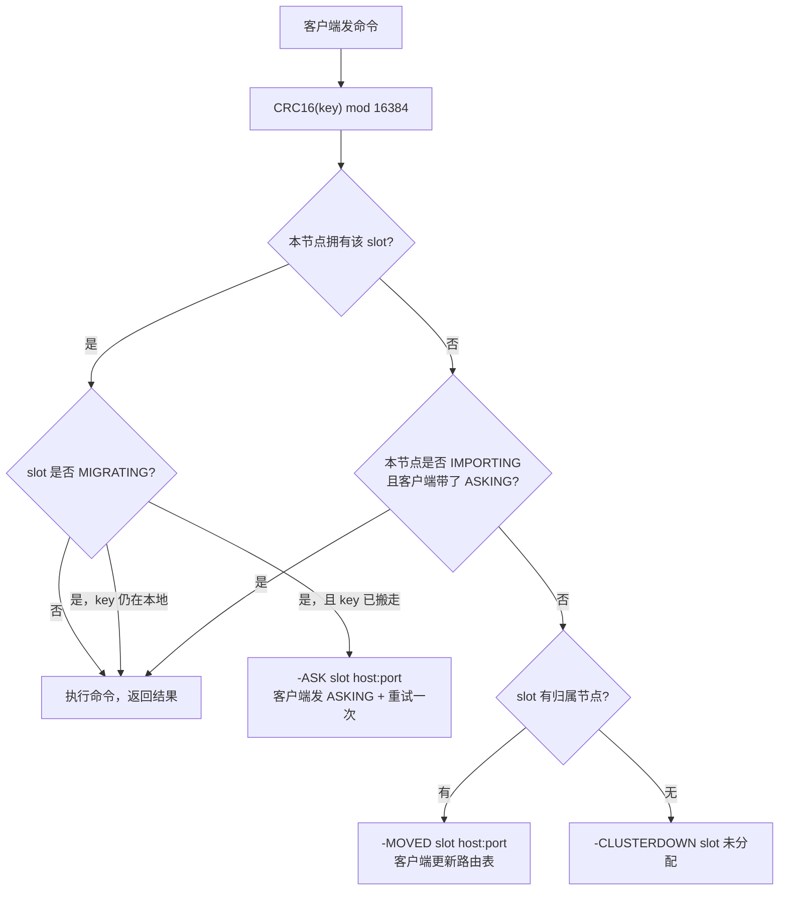

# 第 09 章：Redis Cluster——slot、MOVED/ASK、gossip

> **前置章节**：第 08 章（PSYNC 复制）——Redis Cluster 的每个 shard 内部仍是一套
> 主从复制，理解复制协议有助于理解 Cluster 的故障转移。

---

## 1 导读

前八章讲单机。单机 Redis 的瓶颈有两个：内存上限和写入吞吐。Redis Cluster 的答案
是**数据分片（sharding）**：把全量 key 空间分成 16 384 个虚拟格子（hash slot），
每个节点只负责一部分，横向扩容即可。

但分片带来两个新问题：

1. **命令路由**：客户端怎么知道 key 在哪个节点？
2. **集群视图同步**：节点怎么互相知道谁拥有哪些 slot、谁已经宕机？

这一章以 hayakv 的 `internal/rediscluster/` 为教材，从协议规范到 Go 代码，把上面
两个问题讲清楚。

---

## 2 Redis Cluster 原理

### 2.1 为什么是 16 384 个 slot

Redis 用 `CRC16(key) mod N` 把 key 映射到 slot，N 是 slot 总数。Antirez 在
设计时选 16 384（= 2¹⁴），而不是更直观的 65 536（= 2¹⁶），理由是权衡心跳包大小：

- 每个 Redis Cluster 节点在 PING/PONG 心跳包里都要携带一张**slot 位图**，用来
  告诉对方自己拥有哪些 slot。
- 16 384 个 bit = **2 048 字节（2 KB）**。
- 65 536 个 bit = 8 KB——对于一个每秒要往每个邻居发送心跳的集群来说，8 KB 的
  固定开销太大；而 2 KB 可以接受。
- 另一方面，实际部署的 Redis Cluster 很少超过 1 000 个节点，16 384 个 slot
  已经够用（平均每节点 16 个以上）。

这是一个经典的工程权衡：2 KB 位图 vs 更细的 slot 粒度。

### 2.2 hash tag：多 key 操作的逃生门

默认情况下 `key1` 和 `key2` 可能散列到不同 slot，跨 slot 的多 key 命令会被拒绝
（`CROSSSLOT`）。**Hash tag** 是逃生门：如果 key 里包含 `{...}` 格式，只对大括号
里的内容取哈希：

```
{user}.a   --hash--> CRC16("user") mod 16384 = 5474
{user}.b   --hash--> CRC16("user") mod 16384 = 5474   ← 同 slot!
user.a     --hash--> CRC16("user.a") mod 16384 = 16216 ← 不同 slot
```

这样把同一逻辑对象的多个 key 命名为 `{userid}.field1`、`{userid}.field2`，就可以
让它们落在同一 slot，使 `MGET`、`MULTI/EXEC` 等多 key 操作合法。

### 2.3 客户端重定向：MOVED vs ASK

这是本章最核心的概念，两者**语义不同**。

#### MOVED——slot 稳定归属于他节点

```
-MOVED 5474 127.0.0.1:7001
```

含义：slot 5474 **当前且稳定地**由 `127.0.0.1:7001` 负责。客户端应当**更新本地路
由表**，之后对这个 slot 的所有命令都直接发往那台节点，不必再回来。

#### ASK——迁移进行中的一次性重定向

```
-ASK 5474 127.0.0.1:7001
```

含义：slot 5474 正在从本节点迁移到 `127.0.0.1:7001`，被查询的那个 key **已经搬过
去了**，但迁移还没结束，整个 slot 还没正式交割。客户端应当：

1. 向 `127.0.0.1:7001` **先发一条 `ASKING` 命令**（把一次性标志告知目标节点）。
2. 再重试原命令。
3. **不要更新路由表**——这次重定向是临时的，下一次可能还会发回来。

为什么需要 `ASKING`？目标节点处于 `IMPORTING` 状态，正常情况下它会对这个 slot 的
key 返回 MOVED（因为 slot 在配置上还没归它）。`ASKING` 是客户端的声明：「我知道你
正在导入这个 slot，请给我例外服务一次」。

| | MOVED | ASK |
|---|---|---|
| 触发条件 | slot 已永久归属他节点 | slot 迁移中，key 已搬走 |
| 客户端行为 | 更新路由表，后续直连 | 发 ASKING 后重试一次，不更新路由表 |
| 目标节点 | 正常拥有该 slot | 处于 IMPORTING 状态 |

### 2.4 slot 迁移流程

迁移是一个**逐 key 转移**的过程，由管理员（或 redis-cli --cluster）协调：

1. 在**目标节点**执行 `CLUSTER SETSLOT <slot> IMPORTING <源节点id>`
   → 目标节点进入 `IMPORTING` 状态。
2. 在**源节点**执行 `CLUSTER SETSLOT <slot> MIGRATING <目标节点id>`
   → 源节点进入 `MIGRATING` 状态。
3. 源节点用 `CLUSTER GETKEYSINSLOT` 枚举 key，逐个 `MIGRATE` 到目标。
4. 所有 key 搬完后，在所有节点广播 `CLUSTER SETSLOT <slot> NODE <目标节点id>`
   → 正式切换所有权，清除 MIGRATING/IMPORTING 标志。

迁移进行中的路由规则：

- 客户端访问**源节点**：
  - key 还在本地 → 正常服务
  - key 已搬走 → 返回 `ASK`
- 客户端访问**目标节点**（带了 ASKING）→ 例外服务
- 客户端访问**目标节点**（没带 ASKING）→ 返回 MOVED（指回源节点）

### 2.5 gossip 总线：节点发现与故障检测

Redis Cluster 节点之间通过**集群总线（cluster bus）**交换信息，默认端口是数据端口
加 10 000（例如数据端口 6379 对应总线端口 16 379）。

总线协议是自定义的二进制格式，主要消息类型：

| 类型 | 值 | 说明 |
|---|---|---|
| PING | 0 | 主动探活，携带 gossip 条目 |
| PONG | 1 | PING 的回应，也携带 gossip 条目 |
| MEET | 2 | 第一次握手（`CLUSTER MEET` 触发）|
| FAIL | 3 | 广播某节点已确认宕机 |
| FAILOVER_AUTH_REQUEST | 4 | 副本请求投票 |
| FAILOVER_AUTH_ACK | 5 | 主节点授予投票 |

每条消息的**固定头**（header）包含：发送者 ID、数据端口、总线端口、flags、
configEpoch、以及自己的 2 KB slot 位图。头之后附带若干条 **gossip 条目**，每条
描述一个邻居节点的 ID、IP、端口、flags——这就是「gossip」的来源：你见过谁、
他的状态怎样，都随心跳顺带传播出去。

**故障检测**分两阶段：

1. **PFAIL（Possible Failure）**：某节点在 `cluster-node-timeout` 毫秒内没有
   回应 PING，本节点将其标记为 PFAIL（仅自己认为，不广播）。
2. **FAIL（Confirmed Failure）**：当集群中**多数派主节点**都报告同一节点 PFAIL
   时（通过 gossip 汇聚），任意一个发现达到 quorum 的节点会将其升级为 FAIL，
   并广播 FAIL 消息——此时所有节点都立即接受这个事实。

### 2.6 故障转移：副本竞选与 epoch 投票

一旦主节点被标记 FAIL，它的副本（replica）开始竞选：

1. 副本向所有主节点广播 `FAILOVER_AUTH_REQUEST`，携带递增的 **configEpoch**。
2. 每个主节点在「本 epoch 内只投一票」的规则下，向**最先**发来请求的副本回复
   `FAILOVER_AUTH_ACK`。
3. 副本收到**多数派主节点**的票后，调用 `claimOwnership`：把自己从副本升为
   主节点，接管故障节点的全部 slot，并广播新的配置。
4. **epoch（纪元）**机制确保了收敛：更高 epoch 的配置覆盖更低 epoch 的配置，
   防止脑裂。

### 2.7 流程图



---

## 3 hayakv 实现带读

### 3.1 `crc16.go`：哈希算法与 hash tag

`internal/rediscluster/crc16.go` 是整个路由的起点。

```go
// init() 用多项式 0x1021（CCITT/XMODEM）初始化 256 项查表
const poly = 0x1021
for i := 0; i < 256; i++ {
    crc := uint16(i) << 8
    for j := 0; j < 8; j++ {
        if crc&0x8000 != 0 {
            crc = (crc << 1) ^ poly
        } else {
            crc <<= 1
        }
    }
    crc16tab[i] = crc
}
```

hash tag 提取逻辑（`hashTag` 函数，`crc16.go:39`）：

```go
func hashTag(key []byte) []byte {
    open := -1
    for i := 0; i < len(key); i++ {
        if key[i] == '{' { open = i; break }
    }
    if open < 0 { return key }                   // 无 { → 整个 key
    for j := open + 1; j < len(key); j++ {
        if key[j] == '}' {
            if j == open+1 { return key }         // {} 空标签 → 整个 key
            return key[open+1 : j]                // 取括号内内容
        }
    }
    return key                                    // { 无对应 } → 整个 key
}
```

`Key2Slot`（`crc16.go:62`）：
```go
func Key2Slot(key string) uint16 {
    return crc16(hashTag([]byte(key))) % slotCount
}
```

三个边界情况都被覆盖：无 tag、空 tag `{}`、无闭合 `{`——与 Redis 源码 `keyHashSlot`
行为完全一致，差分测试逐字节验证（`corpus_cluster_test.go` 的
`"keyslot hash tag"` 与 `"keyslot hash tag edge cases"` 场景）。

### 3.2 `node.go`：集群拓扑数据结构

`clusterNode`（`node.go:22`）是单个节点的完整视图：

```go
type clusterNode struct {
    id          string         // 40 hex 字符 Node ID
    ip          string
    port        int            // 数据端口
    cport       int            // 总线端口 = port + 10000
    flags       uint32         // flagMyself | flagMaster | flagSlave | flagPFail | flagFail ...
    masterID    string         // 副本时填主节点 ID
    configEpoch uint64
    pingSent    int64          // 上次发 PING 的时间（Unix ms）
    pongRecv    int64          // 上次收到 PONG 的时间（Unix ms）
    linkUp      bool
    slots       [slotCount/8]byte  // 2048 字节 slot 位图
}
```

2048 字节位图直接嵌在结构体里——这正是 16 384 个 slot 的 2 KB 开销会出现在每条
心跳包里的原因（`gossip.go:33`：`headerLen` 里包含 `slotCount / 8` 字节）。

slot 位操作（`node.go:55`）：
```go
func (n *clusterNode) addSlot(slot uint16) { n.slots[slot/8] |= 1 << (slot % 8) }
func (n *clusterNode) hasSlot(slot uint16) bool {
    return n.slots[slot/8]&(1<<(slot%8)) != 0
}
```

### 3.3 `redirect.go`：MOVED/ASK 发出的地方

`ClusterEngine`（`redirect.go:16`）是最核心的结构体，它**装饰**内层的
`StorageEngine`，在每次命令执行前插入路由检查：

```go
func (ce *ClusterEngine) Exec(c iredis.Connection, cmdLine iface.CmdLine) iredis.Reply {
    // 1. 拦截 CLUSTER / ASKING / READONLY / READWRITE / MIGRATE
    // 2. 提取 key，检查 CROSSSLOT
    slot := Key2Slot(string(keys[0]))
    // 3. 自己是 owner → 尝试 ASK（迁移中 key 已搬走），否则本地执行
    if ce.state.imOwner(slot) { ... }
    // 4. 不是 owner → 先试 ASK（IMPORTING + 客户端带 ASKING），
    //                  否则发 MOVED
    owner := ce.state.ownerOf(slot)
    return protocol.MakeErrReply(
        fmt.Sprintf("MOVED %d %s:%d", slot, owner.ip, owner.port))
}
```

MOVED 在 `redirect.go:95` 生成；ASK 在 `maybeAsk`（`redirect.go:133`）生成：

```go
// Case A：本节点 MIGRATING，key 已不在本地 → ASK
if !allPresent {
    return protocol.MakeErrReply(
        fmt.Sprintf("ASK %d %s:%d", slot, tn.ip, tn.port))
}
// Case B：本节点 IMPORTING，且客户端带了 ASKING → 本地服务
if src := ce.state.importingFrom(slot); src != "" {
    if takeAsking(c) {
        return execLocal(ce.inner, c, cmdLine)
    }
}
```

`ASKING` 命令（`redirect.go:56`）把一次性标志写进连接级 map：
```go
case "ASKING":
    setAsking(c, true)
    return protocol.MakeOkReply()
```

### 3.4 `asking.go`：ASKING 一次性标志

`asking.go` 用一个全局 `map[remoteAddr]bool` 存储连接的一次性标志（`asking.go:9`）。
`takeAsking`（`asking.go:28`）读取并**立即清除**，保证真正的一次性语义：

```go
func takeAsking(c iredis.Connection) bool {
    askingMu.Lock()
    defer askingMu.Unlock()
    v := asking[c.RemoteAddr()]
    delete(asking, c.RemoteAddr())  // ← 读后即删，one-shot
    return v
}
```

### 3.5 `migrate.go`：MIGRATING/IMPORTING 状态对

`clusterState` 里有一张 `migrations map[uint16]*migration`（`state.go:21`），
每个条目记录一个 slot 是在向外迁移（`migratingTo`）还是从外导入（`importingFrom`）：

```go
type migration struct {
    importingFrom string  // 我是目标节点，key 从这个节点搬来
    migratingTo   string  // 我是源节点，key 正在搬到这个节点
}
```

`CLUSTER SETSLOT <slot> MIGRATING <id>` 调用 `state.setMigrating`（`migrate.go:33`），
`SETSLOT <slot> IMPORTING <id>` 调用 `state.setImporting`（`migrate.go:43`），
`SETSLOT <slot> STABLE` 和 `SETSLOT <slot> NODE <id>` 都调用 `clearMigration`
（`state.go:116`）清除状态。

### 3.6 `commands.go`：CLUSTER 子命令家族

`clusterCommands.handle`（`commands.go:33`）实现了如下子命令：

| 子命令 | 位置 | 说明 |
|---|---|---|
| `MYID` | `commands.go:40` | 返回本节点 40 字符 ID |
| `KEYSLOT` | `commands.go:43` | 计算 key 的 slot 编号 |
| `COUNTKEYSINSLOT` | `commands.go:48` | 统计某 slot 的 key 数 |
| `GETKEYSINSLOT` | `commands.go:56` | 枚举某 slot 的 key（用于迁移）|
| `INFO` | `commands.go:74` | 集群状态摘要文本块 |
| `NODES` | `commands.go:78` | 全节点拓扑（nodes.conf 格式）|
| `SLOTS` | `commands.go:80` | slot 范围 → 节点映射（旧式）|
| `SHARDS` | `commands.go:82` | slot 范围 → 节点映射（新式）|
| `ADDSLOTS` | `commands.go:203` | 分配 slot 给本节点 |
| `DELSLOTS` | `commands.go:205` | 移除本节点的 slot |
| `ADDSLOTSRANGE` | `commands.go:207` | 按范围分配 slot |
| `DELSLOTSRANGE` | `commands.go:209` | 按范围移除 slot |
| `SETSLOT` | `commands.go:211` | 切换 MIGRATING/IMPORTING/STABLE/NODE |
| `MEET` | `commands.go:213` | 向指定节点发起握手 |
| `FORGET` | `commands.go:236` | 从本节点视图移除某节点 |
| `RESET` | `commands.go:249` | 重置集群状态 |
| `REPLICATE` | `commands.go:253` | 将本节点设为某主节点的副本 |
| `FAILOVER` | `commands.go:263` | 手动故障转移（FORCE/TAKEOVER）|
| `BUMPEPOCH` | `commands.go:265` | 手动递增 configEpoch |
| `LINKS` | `commands.go:267` | 查看总线连接状态 |
| `COUNT-FAILURE-REPORTS` | `commands.go:269` | 查看某节点的 PFAIL 报告数 |

### 3.7 `gossip.go`：消息泵

`gossipBus`（`gossip.go:164`）有两个 goroutine：

- **`acceptLoop`**：监听总线端口，对每条入连接 `go handleConn(...)`。
- **`pingLoop`**（`gossip.go:423`）：每秒触发，随机挑一个邻居发 PING，并检查
  超时节点（`markPFailIfTimedOut`）、尝试把 PFAIL 升级为 FAIL（`markNodeFail`），
  以及驱动故障转移选举（`checkFailoverTick`）。

心跳包头固定长度 `headerLen = 2130` 字节（`gossip.go:33`），其中 2048 字节是 slot
位图。gossip 条目数上限 `maxGossip = 3`（`gossip.go:338`），优先放 FAIL 节点以
保障故障信息快速传播：

```go
const maxGossip = 3
// 先放 FAIL 节点，再补非 FAIL 节点，总数不超过 maxGossip
```

`mergeFromMessage`（`gossip.go:267`）合并对方视图时遵循 **epoch 优先**规则：只有
对方的 configEpoch **高于**当前记录值，才接受其 slot 声明。这防止了旧信息覆盖新
信息：

```go
if old != nil && old.configEpoch >= h.configEpoch {
    continue // 当前记录 epoch 不低于对方，跳过
}
```

### 3.8 `failure.go`：PFAIL → FAIL 升级

`markPFailIfTimedOut`（`failure.go:75`）检查所有节点：若 `pongRecv` 距今超过
`cluster-node-timeout` 毫秒，打上 `flagPFail` 并记录自己的 failure report。

`markNodeFail`（`failure.go:98`）检查 quorum：只统计**主节点**的报告（副本的
PFAIL 报告不算数），`quorum = 多数派 = masterCount/2 + 1`。一旦达到 quorum，把
`flagPFail` 替换为 `flagFail` 并返回 `true`，触发 pingLoop 广播 FAIL 消息
（`gossip.go:439`）。

### 3.9 `failover.go`：副本提升路径

`startElection`（`failover.go:73`）递增 epoch，广播 `FAILOVER_AUTH_REQUEST`。
`grantVote`（`failover.go:27`）实现四个投票条件：reqEpoch 不低于当前 epoch、
本 epoch 未投票、目标主节点确实 FAIL、申请者是该主节点的副本。
`recordVote`（`failover.go:109`）累积票数，`checkFailoverTick`（`failover.go:193`）
检测是否赢得多数票，赢了则调用 `claimOwnership`（`failover.go:136`）：把自己从
副本翻转为主节点，接管所有 slot。

### 3.10 差分语料佐证

`test/diff/corpus_cluster_test.go` 中的 `clusterCorpus()` 函数聚焦于
**`CLUSTER KEYSLOT`**——它是纯 `CRC16(key) mod 16384` 加 hash tag 提取，
不依赖节点 id、端口或 epoch，因此能与真实 Redis 8 逐字节对拍：纯 key、空 key、
hash tag、空 tag `{}`、首个非空 tag 优先、以及 tag 等价性等场景全部覆盖。

而 `CLUSTER MYID / NODES / INFO / SLOTS / SHARDS / ADDSLOTSRANGE /
COUNTKEYSINSLOT / GETKEYSINSLOT` 的回复内嵌随机节点 id、各实例不同的端口与
epoch，**天生无法逐字节对拍**，因此不放进差分语料，改由
`internal/rediscluster/` 的单元测试覆盖——这正是第 10 章"非确定性是逐字节
比较的天敌"的一个实例。

---

## 4 动手验证

下面的实验在单节点上进行，用临时配置文件启动 hayakv。

```bash
# 准备临时目录和配置
mkdir -p /tmp/hkv-cluster
cat > /tmp/hkv-cluster/redis.conf << 'EOF'
bind 127.0.0.1
port 6399
cluster-enable yes
cluster-mode redis
cluster-config-file /tmp/hkv-cluster/nodes.conf
cluster-node-timeout 15000
dir /tmp/hkv-cluster
EOF

# 启动服务（后台）
CONFIG=/tmp/hkv-cluster/redis.conf ./hayakv &
sleep 1
```

**hash tag：`{user}.a` 与 `{user}.b` 落在同一 slot**

```
$ redis-cli -p 6399 cluster keyslot '{user}.a'
(integer) 5474

$ redis-cli -p 6399 cluster keyslot '{user}.b'
(integer) 5474

$ redis-cli -p 6399 cluster keyslot 'user.a'
(integer) 16216
```

前两个 key 的 hash tag 都是 `user`，所以得到相同的 slot 5474。
`user.a` 没有 `{}` 标签，对整个字符串取哈希，结果不同（16216）。

**集群信息**

```
$ redis-cli -p 6399 cluster info | head -5
cluster_enabled:1
cluster_state:fail
cluster_slots_assigned:0
cluster_slots_ok:0
cluster_slots_pfail:0
```

单节点还没分配 slot，所以 `cluster_state:fail`（16 384 个 slot 全部未分配时
为 fail），这和真实 Redis 行为一致。

**节点 ID**

```
$ redis-cli -p 6399 cluster myid
"6ba17edb93ce4b32f8f8fce0c843bae295677f8c"
```

ID 是 20 字节随机数的十六进制，每次启动（且 nodes.conf 不存在时）重新生成。

**清理**

```bash
pkill -f hayakv
rm -rf /tmp/hkv-cluster
```

**单元测试**

```bash
go test -race ./internal/rediscluster/ -count=1
# ok  github.com/amemiya02/hayakv/internal/rediscluster  1.344s
```

覆盖了 gossip 握手、PFAIL 传播、FAIL 接受、MIGRATING/ASK、IMPORTING/ASKING、
MOVED/CROSSSLOT/keyless 路由等全部主路径，15 个用例全部通过。

**差分测试（需本地 `redis-server` 或 Docker）**

`clusterCorpus()` 由 `TestDifferentialCluster`（`test/diff/harness_cluster_test.go`）
驱动：它在两侧各启动一个**开启了集群模式**的服务端（hayakv `cluster-enable yes`
+ 真实 `redis-server --cluster-enabled yes`），对 `CLUSTER KEYSLOT` 逐字节对拍。
集群模式要求端口 ≤ 55535（gossip 总线 = 端口 + 10000，须落在 uint16 内），
harness 用专门的 `freeClusterPort` 选端口。

```bash
go test ./test/diff -run TestDifferentialCluster -count=1 -v
```

本机若既无 `redis-server` 也无 Docker，测试会干净跳过（skip），不视为失败。

---

## 5 延伸阅读

- **Redis Cluster 规范**（官方权威文档）：
  [redis.io/docs/latest/operate/ors/reference/cluster-spec/](https://redis.io/docs/latest/operate/ors/reference/cluster-spec/)
- **Redis Cluster 教程**：
  [redis.io/docs/latest/operate/ors/reference/cluster-tutorial/](https://redis.io/docs/latest/operate/ors/reference/cluster-tutorial/)
- **Redis 源码** `cluster.c` / `cluster.h`：Antirez 最初实现，注释详尽，是理解
  协议细节的第一手资料。
- **本仓库配置参考** `../dev/config.md`：CLUSTER 配置组（`cluster-enable`、
  `cluster-mode`、`cluster-config-file`、`cluster-node-timeout`）。
- 下一章 **第 10 章：差分测试——如何验证「逐字节一致」**，讲解 hayakv 如何用
  Docker 自动拉起 Redis 8 进行差分验证。

---

## 附：`internal/cluster/` 的定位

仓库里有两套集群：本章讲的 `internal/rediscluster/` 是 **Redis Cluster 协议的
忠实实现**（MOVED/ASK/gossip/slot 迁移），目标是与真实 Redis Cluster 客户端互
操作，由 `cluster-mode redis` 选择。

`internal/cluster/` 则是 godis 遗留的**透明代理集群**：基于 Raft 共识，把任意
命令自动路由到正确分片，客户端无需感知分片——相当于在应用层做了一个对客户端透明
的分布式 KV 门面。两者目标不同：前者追求 Redis 协议兼容，后者追求使用透明。
`cluster-mode` 为空或非 `redis` 时，启用后者（`config/config.go:61`）。
